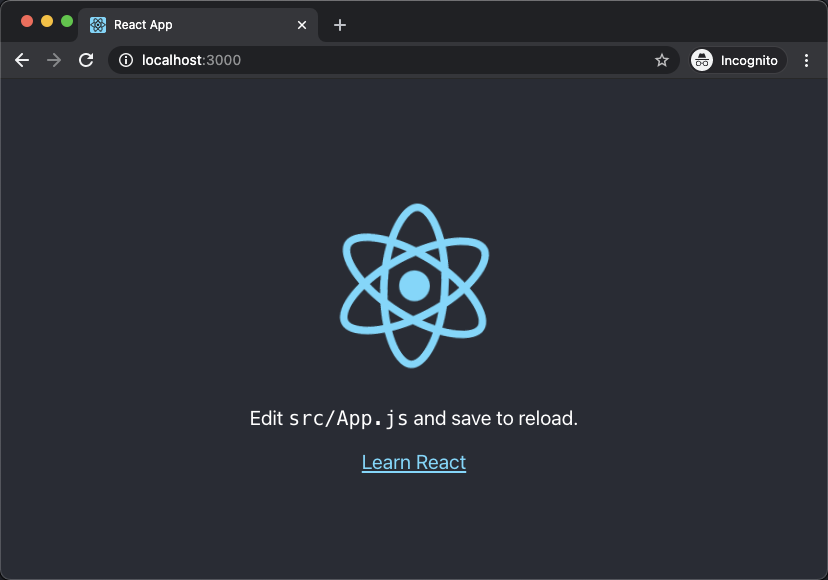

# Creating a React App

This is a guide to creating your first app with React! In this walkthrough will have you building an application in React from scratch and learning some cool tools that come with it.

# Prerequisites

Before we dive in, there are a few things that you should know in advance before you start playing around with React. 

- Basic knowledge of [HTML & CSS](https://www.internetingishard.com/).
- Basic familiarity of [JavaScript](https://www.digitalocean.com/community/tutorial_series/how-to-code-in-javascript) and/or programming.
- [Node.js and npm](https://docs.npmjs.com/downloading-and-installing-node-js-and-npm) are installed globally.

# Goal

By the end of this guide, you should have a good idea of how to create a React app and familiarity of concepts such as JSX, components, props, state, and lifecycle.

To teach these topics, we will be creating a morse code translator.

# What is React?

- React is **one of the most popular JavaScript** libraries with over 150,000 stars on GitHub.
- React is an open-sourced repository created by **Facebook**.
- React is used on the **front-end** for building user interfaces (UI).
- React is **component-based** meaning you can reuse encapsulated components that manage their own state then compose them to make a complex UI.
- React streamlines how data is stored and handled, using **state** and **props**.

Throughout this guide, we'll go over more about React with hands on learning.

# Setup and Installation

Before we setup our first React app, verify that you have [Node.js and npm](https://docs.npmjs.com/downloading-and-installing-node-js-and-npm) installed globally. This will be important to create and run our app.

After these tools are installed, we can use Facebook's pre-configured environment,  [Create React App](https://github.com/facebook/create-react-app). This will create a new folder with everything you need to build a React app.

To setup `create-react-app`, run the following code in your terminal where you want your project directory to live.

```bash
npx create-react-app myapp
```

This might take a little bit to install if it is your first time installing. Once it's finished, move into the newly created directory and start the project

```bash
cd myapp
npm start
```

After running this command, a new window will open at [`localhost:3000`](http://localhost:3000) with your new React app that will look similar to below.



If you dig into the project structure, you'll see a `/public` and `/src` directory, along with the standard `node_modules`, `.gitignore`, `README.md`, and `package.json`.

In `/public`, our most important file is `index.html`. It is our `root` div that will have React injected into it. The `/src` directory is what contains all our React code.

Feel free to edit `src/App.js` and see what changes in your browser window.

# JSX

If you look around the codebase, you might have been seeing what looks like HTML inside our React code. This is **JSX**, which means JavaScript XML.

What's great about JSX is that you're able to combine all of the powerful features of JavaScript into HTML. For example, we can assign JSX to a variable.

```jsx
const heading = <h1 className="site-heading">Welcome to Hacklahoma!</h1>
```

At the end of the day, JSX is not HTML. So there are some differences that you'll note when writing it.

* `className` is used instead of `class` when adding a CSS class. This is because `class` is a reserved keyword in JavaScript.
* Properties and methods in JSX are camelCase (`onclick` will become `onClick`)
* Self-closing tags are required to end in a slash (``)

JavaScript can also be embedded inside JSX using curly braces. This includes variables, functions, and properties. 

```jsx
const event = 'Hacklahoma'
const heading = <h1>Welcome to {event}!</h1>
```

# Components

Ok, let's get back on track. So far, we've setup our `create-react-app`. Almost everything in React consists of components. Most React apps have many small components and are loaded into the main `App` component. 

If we navigate to `src/index.js`, you'll find something similar to

```jsx
ReactDOM.render(<App />, document.getElementById('root'));
```

This line is what injects our main `App` component into the our `root` div that we saw earlier in `public/index.html`. Without this line, nothing would show in our browser.

# Props

# State

# Deployment

# Conclusion

We only scratched the surface! We hope this gave you a great introduction to React, simple and class components, state, props, and deploying an app. There is so much more to learn and do with React. We hope you feel confident playing around with React yourself now.

Keep in mind that mentors are here to help! Please do not hesitate to reach out and ask for help. 

This guide was heavily inspired by [Tania Rascia](https://www.taniarascia.com/). Visit her website to learn more!