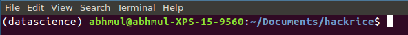
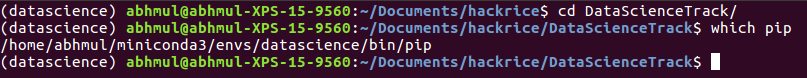
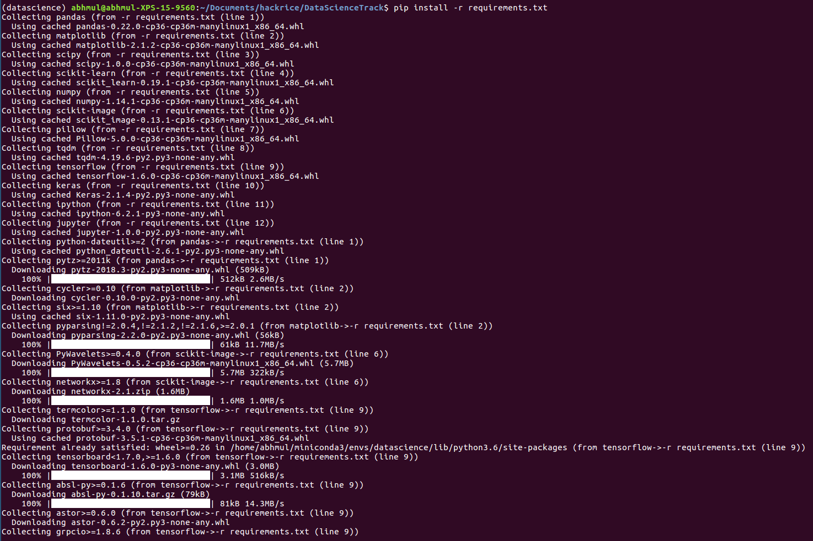
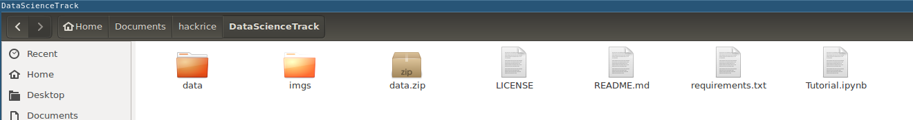
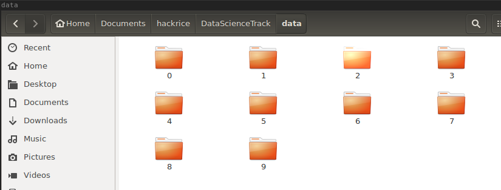
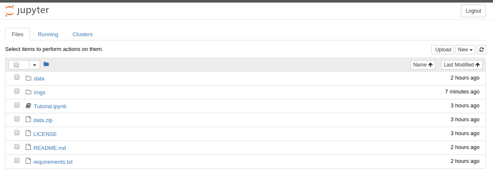
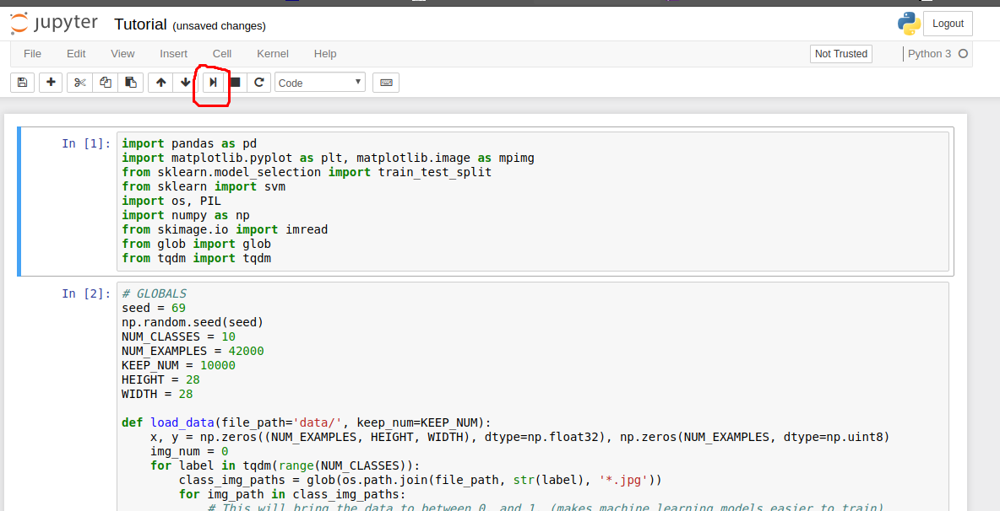

# DataScienceTrack
HackRice 7.5 - Data Science Track

## Introduction

Have you ever looked for shoes online and found related advertisements on facebook and other websites continuously for a week? Or say, you’re chatting with your best friend and the keyboard suggests you the exact words that you want to use in your sentence? How does YouTube show all your favourite videos on your homescreen?

Well these are all applications of Data Science. Over the last few years Data Science has really changed our concept of technology. Our lives are a lot easier as compared to 10yrs ago, and this is all because of data science. Data Science has really pulled the ends between fiction and technology. Right from LinkedIn to Tinder, data science is being used everywhere.

These tutorials will give you a brief introduction into some basic applications of machine learning and data science along with example prompts to compete in this track. To compete though, any data science project will do.

Below we have instructions for getting started with our [beginner data science tutorial](https://github.com/abhmul/DataScienceTrack/blob/master/BeginnerTutorial.ipynb) about a famous computer vision problem. In addition, we have several other tutorials:

* [Natural Language Processing Tutorial](https://github.com/abhmul/DataScienceTrack/blob/master/NLP/IMDB.ipynb)
* [Deep Reinforcement Learning Tutorial w/ Tensorflow](https://medium.com/tensorflow/deep-reinforcement-learning-playing-cartpole-through-asynchronous-advantage-actor-critic-a3c-7eab2eea5296)
* [Neural Style Transfer Tutorial w/ Tensorflow](https://medium.com/tensorflow/neural-style-transfer-creating-art-with-deep-learning-using-tf-keras-and-eager-execution-7d541ac31398)
* [Image Segmentation](https://github.com/tensorflow/models/blob/master/samples/outreach/blogs/segmentation_blogpost/image_segmentation.ipynb)

### Prompt

As long as your project uses some application of data science or machine learning, anything goes! If you're looking for some specific prompts, check out the prompts and links at the bottom of our beginner tutorial. They include

* prompts
* datasets
* ideas on how to get started

In addition, the [Google Dataset Search](https://toolbox.google.com/datasetsearch) is a great resource to find public datasets!

### A Quick Note on the Beginner Tutorial

The steps below outline how to setup your computer to view and run the code in this repository using JuPyter Notebook. If you just want to read through the tutorial, you can [view the beginner notebook online through GitHub](https://github.com/abhmul/DataScienceTrack/blob/master/BeginnerTutorial.ipynb)

## Tools needed

Before we start, make sure you understand what **terminal** is. For Linux and Mac users this will be called *terminal*. Windows users have multiple variations that are similar to the Linux and Mac terminal(namely *Command Prompt* and *PowerShell*). However, for this tutorial, we recommend Windows users download and use *Cygwin* (instructions on how to do so are included below). *Cygwin* mimics *terminal* from Linux and Mac. To learn about how to use a *terminal*, try out [Codecademy's tutorial](https://www.codecademy.com/courses/learn-the-command-line/lessons/navigation/exercises/your-first-command).

Tools We Need
This tutorial requires Python and JuPyter Notebook. To run our Python code we need:

* Either [Python 2 or 3](https://www.fullstackpython.com/python-2-or-3.html) (Python 2 must be at least version 2.7.9, Windows will require python3)
* [pip](https://pip.pypa.io/en/stable/) and
  [virtualenv](https://virtualenv.pypa.io/en/stable/) to handle Python
  [git](https://git-scm.com/book/en/v2/Getting-Started-Installing-Git) to get the data and code
  
  
If you do not have python currently, we suggest installing [Anaconda](https://www.anaconda.com/download/) (use the python3 version) since it includes almost everything we need.

In addition, Windows users will need To install Cygwin (more on this below).

### Cygwin installation (Windows users only)

Visit [this website](https://cygwin.com/install.html) to install Cygwin.  For each screen on the installer where it provides a default option, the default is fine.  However, there is one screen that asks you to "Choose A Download Site".  Any site should work; however, some work better than others.  'https://mirror.steadfast.net' works well.

### Pip installation
If you don't already have pip installed, we'll go ahead an install that now because it will be essential 
for the rest of the project. 

Visit [this website](https://pip.pypa.io/en/stable/installing/) to install pip. Follow the instructions, and once you 
think you're done, type `which pip` to check that pip has been installed. You should see the version number of the pip 
you installed print to your terminal.

## Establishing your environment

### Using Virtualenv

We now know what tools we need for our project so let's get our development
environment set up. Go to the terminal (or Cygwin on Windows) and
change into the directory where you want to store this project. Within
that directory, create a new virtualenv to isolate our application
dependencies from other Python projects.

    virtualenv datascience

Activate the virtualenv (Mac/Linux):

    source datascience/bin/activate

Activate the virtualenv (Windows):

    source datascience/Scripts/activate

### Using Anaconda

Go to the terminal (or Cygwin on Windows) and
change into the directory where you want to store this project. Within
that directory, create a new conda environment to isolate our application
dependencies from other Python projects.

```
conda create -n datascience pip
```
Activate the virtualenv:this 

```
source activate datascience
```

Once you activate your env, your terminal should look something like this:



### Downloading the code and data

You should currently be in the directory where you want to store this project. Run the following command to clone the data and code into this directory
```
git clone https://github.com/abhmul/DataScienceTrack.git
```

You should now have a folder called `DataScienceTrack`. Change your directory in your terminal to this directory (run something like `cd DataScienceTrack`). You now have all the code and data for the projects

### Installing necessary packages

**Note: If you're using python3.7, Tensorflow has not released a package yet, so if you are an Mac or Linux you can run:**
```bash
# MacOS
pip install --upgrade https://storage.googleapis.com/tensorflow/mac/cpu/tensorflow-1.10.1-py3-none-any.whl  e inst
# Linux
pip install --upgrade https://storage.googleapis.com/tensorflow/linux/cpu/tensorflow-1.10.1-cp36-cp36m-linux_x86_64.whl
```
**If you're running Windows, the installation is very complicated. We recommend downloading [Anaconda for Python3.6](https://www.anaconda.com/download/#windows) and running the normal installation in this README.**

We've included a `requirements.txt` file so `pip` knows which packages to install. To make sure we're using the right `pip` (the one associated with our virtual environment) run
```
which pip
```
The terminal should print out something along the lines `.../datascience/bin/pip` where the `...` is some stuff specific to your computer. **If this is not the case, flag down a mentor to help you out.** If you're all good, then run the following command (from inside the `DataScience` folder).



```
pip install -r requirements.txt
```
This should go ahead and grab any python packages we need that you don't already have. You'll see a lot of output like in the example below. **If something goes wrong here, make sure to ask for help**.



## Preparing the data

You should currently still be in the `DataScienceTrack` folder. In here go ahead and extract `data.zip` into a folder called `data`.
 
 
 
 If you're curious, you can take a look at these data. They are just a bunch of images of handwritten digits in different folders named by what digit is in the folder.
 
 
 

## Running the notebook

From the folder `DataScienceTrack`, run the command
```
jupyter notebook
```
This should open a browser tab with JuPyter. 



You'll see a bunch of files listed. Double-click on `Tutorial.ipynb` to open up the python notebook. The notebook includes interactive code blocks that you can run, modify, and view the output of. To run a cell simply click on it, then click on the *run cell* button in the toolbar at the top (looks sort've like a play button).


