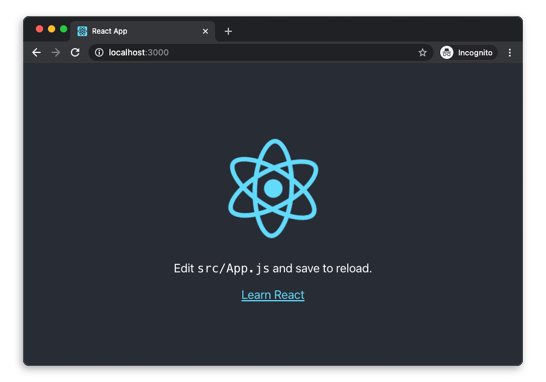
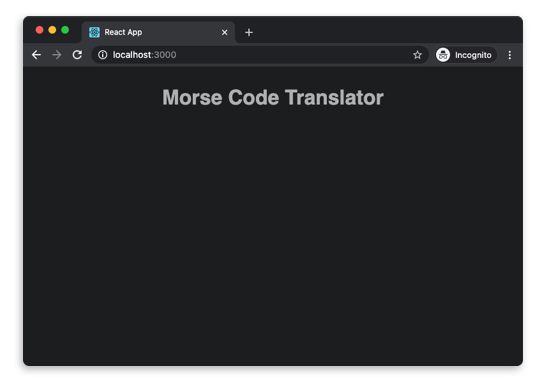

# Creating a React App

This is a guide to creating your first app with React! In this walkthrough will have you building an application in React from scratch and learning some cool tools that come with it.

# Prerequisites

Before we dive in, there are a few things that you should know in advance before you start playing around with React. 

- Basic knowledge of [HTML & CSS](https://www.internetingishard.com/).
- Basic familiarity of [JavaScript](https://www.digitalocean.com/community/tutorial_series/how-to-code-in-javascript) and/or programming.
- [Node.js and npm](https://docs.npmjs.com/downloading-and-installing-node-js-and-npm) are installed globally.

# Goal

By the end of this guide, you should have a good idea of how to create a React app and familiarity of concepts such as JSX, components, props, state, and lifecycle.

To teach these topics, we will be creating a morse code translator.

# What is React?

- React is **one of the most popular JavaScript** libraries with over 150,000 stars on GitHub.
- React is an open-sourced repository created by **Facebook**.
- React is used on the **front-end** for building user interfaces (UI).
- React is **component-based** meaning you can reuse encapsulated components that makes use of hooks like `useState` to make a complex UI.
- React streamlines how data is stored and handled, using **state** and **props**.

Throughout this guide, we'll go over more about React with hands on learning.

# Setup and Installation

Before we setup our first React app, verify that you have [Node.js and npm](https://docs.npmjs.com/downloading-and-installing-node-js-and-npm) installed globally. This will be important to create and run our app.

After these tools are installed, we can use Facebook's pre-configured environment,  [Create React App](https://github.com/facebook/create-react-app). This will create a new folder with everything you need to build a React app.

To setup `create-react-app`, run the following code in your terminal where you want your project directory to live.

```bash
npx create-react-app myapp
```

This might take a little bit to install if it is your first time installing. Once it's finished, move into the newly created directory and start the project

```bash
cd myapp
npm start
```

After running this command, a new window will open at [`localhost:3000`](http://localhost:3000) with your new React app that will look similar to below.



If you dig into the project structure, you'll see a `/public` and `/src` directory, along with the standard `node_modules`, `.gitignore`, `README.md`, and `package.json`.

In `/public`, our most important file is `index.html`. It is our `root` div that will have React injected into it. The `/src` directory is what contains all our React code.

Feel free to edit `src/App.js` and see what changes in your browser window.

For this guide, remove all files from the `/src` directory so that we can create our own boiler plate.

Now we can start fresh. Still inside the `/src` directory, let's create three new files called `App.js`, `App.css`, and `index.js`. 

We'll start with `App.js`. This will be our main component that we'll touch on later. Copy and paste the following

```jsx
import React from 'react';
import './App.css';

const App = () => {
  return (
    <div className="App">
      <h1>Morse Code Translator</h1>
    </div>
  );
}

export default App;
```

And in the file `index.js`, we'll copy and paste the following

```jsx
import React from 'react';
import ReactDOM from 'react-dom';
import App from './App';

ReactDOM.render(<App />, document.getElementById('root'));
```

We'll also add some styling in `App.css` for later.

```css
body {
  background: #1C1D1F;
  color: #AFB0B2;
  font-family: sans-serif;
  text-align: center;
}

h1 {
  text-align: center;
}

textarea {
  font-size: 16px;
  padding: 15px;
  color: #AFB0B2;
  background: #343536;
  border: none;
  height: 150px;
  width: 100%;
  box-sizing: border-box;
  outline-color: grey;
}

.output p {
  font-family: monospace;
}

.App {
  display: inline-flex;
  flex-flow: column;
  width: 90%;
  max-width: 800px;
  text-align: left;
}
```

If we run `npm start` again, we should see something that looks like this



You can quit the development build by pressing `ctrl` + `c`

Finally, we need to install a dependency called [`morsee`](https://www.npmjs.com/package/morsee) so that we can encode a message into morse code. While still in your project folder, execute the command in your terminal

```bash
npm install morsee
```

# JSX

If you recall the `App.js` file, you might have noticed what looks like HTML inside our React code. This is **JSX**, which means JavaScript XML.

What's great about JSX is that you're able to combine all of the powerful features of JavaScript into HTML. For example, we can assign JSX to a variable.

```jsx
const heading = <h1 className="site-heading">Welcome to Hacklahoma!</h1>
```

At the end of the day, JSX is not HTML. So there are some differences that you'll note when writing it.

* `className` is used instead of `class` when adding a CSS class. This is because `class` is a reserved keyword in JavaScript.
* Properties and methods in JSX are camelCase (`onclick` will become `onClick`)
* Self-closing tags are required to end in a slash (``)

JavaScript can also be embedded inside JSX using curly braces. This includes variables, functions, and properties. 

```jsx
const event = 'Hacklahoma'
const heading = <h1>Welcome to {event}!</h1>
```

# Components

Ok, let's get back on track. So far, we've setup our `create-react-app`. Almost everything in React consists of components. Most React apps have many small components and are loaded into the main `App` component. We'll be doing the same thing in this guide.

If you recall back to when you created `src/index.js`, you' noticed we pasted in

```jsx
ReactDOM.render(<App />, document.getElementById('root'));
```

This line is what injects our main `App` component into the our `root` div that we saw earlier in `public/index.html`. Without this line, nothing would show in our browser.

Let's now create a new directory called `components` inside our `src` directory. This will house all of our smaller components that we'll eventually load into `App.js`.

Inside your newly created `components` directory, create a new file called `Input.js`. Copy and paste the following

```jsx
import React from 'react';

const Input = () => {
  return (
    <div className="input">
      <h2>Input</h2>
      <input placeholder="Type your message here" />
    </div>
  );
}

export default Input;
```

We'll do the same thing but for our output component. Create the file `Output.jsx` and copy and paste the following

```jsx
import React from 'react';
import { encode } from 'morsee';

const Output = () => {
  return (
    <div className="output">
      <h2>Output</h2>
      <p>{encode('hello world!')}</p>
    </div>
  );
}

export default Output;
```

For the `Output` component, we import the `morsee` dependency so that we can use one of its functions to encode text into morse code. We also made use of JSX's feature to include javascript by surrounding it in curly brackets.

You'll notice a trend here. We are importing the `react` dependency, creating a function which returns a JSX Element, then exporting that function. We capitalize these components to differentiate them from regular HTML tags.

But why are we wrapping these components in a div container? This is because [JSX requires elements to be wrapped in one container](https://medium.com/javascript-in-plain-english/why-do-we-have-to-wrap-react-components-b168232dbd3a).

Ok cool! But this isn't showing in the browser. Correct! We need to tell react where to show it. That's where `App.js` comes in.

Let's edit `App.js` to look like the following

```jsx
import React from 'react';
import './App.css';
import Input from './components/Input';
import Output from './components/Output';

const App = () => {
  return (
    <div className="App">
      <h1>Morse Code Translator</h1>
      <Input />
      <Output />
    </div>
  );
}

export default App;
```

We are essentially importing the `Input` and `Output` components we just created and loading them into where we want them in our app component. Which is right below our header.

Your browser should now look like this


# Props

Awesome! We've setup our components and told react where they should go. But how do we give these components data from other components? That's when **props** come in. Props are added as properties to a component.

You should still have the `App.js` file open, let's add a prop to the Output component called `value`

```jsx
<Output value="hello world!" />
```

This prop has now been passed into the Output component as a parameter. We'll access the props in `Output.js` and replace the hardcoded string to the prop we passed through

```jsx
import React from 'react';
import { encode } from 'morsee';

const Output = (props) => {
  return (
    <div className="output">
      <h2>Output</h2>
      <p>{encode(props.value)}</p>
    </div>
  );
}

export default Output;
```

Props are an effective way to pass existing data to a React component, however the component cannot change the props - they're read-only. In the next section, I'll show you how to use the hook `useState` to have further control over handling data in React. 

# State

Right now, we're unable to give our output dynamic data that the user types in the input component. With the `useState` hook, we can do just that.

You can think of state as any data that should be saved and modified without necessarily being added to a database - for example, adding and removing items from a shopping cart. However, the state is stored in the session, meaning all data is lost as soon as the browser is refreshed.

To start, we'll open `App.js` and import `useState` from `react`. Using this new hook, we'll create a state with a default value of an empty string with the value being stored as `value` and its modifier as `setValue`. We'll pass these two into Input and the value into Output as props.

```jsx
import React, { useState } from 'react';
import './App.css';
import Input from './components/Input';
import Output from './components/Output';

const App = () => {
  const [value, setValue] = useState('');

  return (
    <div className="App">
      <h1>Morse Code Translator</h1>
      <Input value={value} setValue={setValue} />
      <Output value={value} />
    </div>
  );
}

export default App;
```

Next, let's open `Input.js` to make use of our state.

We need to do two things: 
1. Tell the input what our current value is
2. Change the value when the input is changed

We can tell the input what our value is by simply giving it a property built into html called `value` and setting it to the prop we passed in

```jsx
<input value={props.value} placeholder="Type your message here" />
```

We'll now detect when the input changes by using the built in property `onChange` which will be given a handler that we can create within the component to update the state. We'll call this `handleChange`

Your `Input.js` file should look like the following

```jsx
import React from 'react';

const Input = (props) => {
  /**
   * Updates the state when the event target's value is changed
   */
  const handleChange = (event) => {
    props.setValue(event.target.value);
  }

  return (
    <div className="input">
      <h2>Input</h2>
      <input 
        value={props.value} 
        onChange={handleChange}
        placeholder="Type your message here" 
      />
    </div>
  );
}

export default Input;
```

Now try it out! Type in a message and watch the output change as you type.


# Deployment

We'll make use of a free service to host our static website called [Netlify](https://www.netlify.com/). They make it incredibly easy for beginners like yourself to host their static websites hassle-free. 

If you've uploaded your work to github, it's even easier to link your github and enjoy automatic deploys. I'll assume you haven't done this.

You'll first need to generate a build that netlify will use. You can do this by executing the following in your project folder

```bash
npm run build
```

This will create a `build` directory that you will upload to netlify.

After creating an account, navigate to the Sites tab and simply drag and drop the `build` directory in your browser.

Boom! EZ PZ. Give it a second to publish and navigate to the given domain (which you can change in the domain settings).


# Conclusion

We only scratched the surface! We hope this gave you a great introduction to React, simple and class components, state, props, and deploying an app. There is so much more to learn and do with React. We hope you feel confident playing around with React yourself now.

Keep in mind that mentors are here to help! Please do not hesitate to reach out and ask for help. 

This guide was heavily inspired by [Tania Rascia](https://www.taniarascia.com/). Visit her website to learn more!