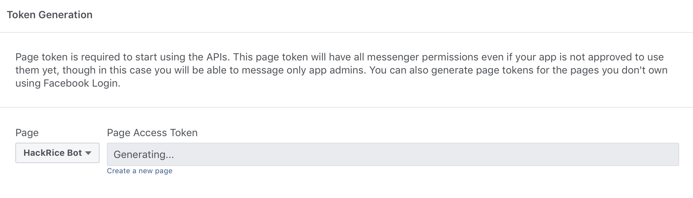

# Facebook Messenger Bot

## Introduction

This document will provide a step-by-step gudie to developing your first Facebook Messenger bot. We'll be using Python since it's a very beginner-friendly language and offers perhaps the simplest implementation. Alternatively, you're welcome to use JavaScript + Node.js, in which case you can find an excellent guide with [Facebook's Quick Start Tutorial](https://developers.facebook.com/docs/messenger-platform/getting-started/quick-start/).

There are a few components that we have to set up in order to get a functional bot. First, we need to set up a server to listen for messages from Facebook. This is a stable point so that Facebook knows what to do when the user messages the bot. *Flask* is a web framework built on Python, so we'll use it to greatly simplify this process. Next, we'll need to enable the bot to respond to the user's messages. We'll code the logic in Python and use the *requests* library to sent the bot's chosen response back to Facebook. Finally, since we're developing this locally, we can use a cool tool called *ngrok* to expose the code on our local machine to the web, so that we don't have to host this anywhere and can run our bot from our local machine. We'll explain each of these steps in more detail as we go through them. 

For a simple, instructive example, we'll configure our Messenger bot to 


## Software

Before we begin, we need to make sure all the necessary software is installed. Here are the things you'll need:
* [Python 3.6.5](https://www.python.org/downloads/release/python-365/)
* Pip3 (we'll show you how to install this later)


### Cygwin installation (Windows users only)

Visit [this website](https://cygwin.com/install.html) to install Cygwin.  For each screen on the installer where it provides a default option, the default is fine.  However, there is one screen that asks you to "Choose A Download Site".  Any site should work; however, some work better than others.  [This site](https://mirror.steadfast.net) works well.

From this point on, whenever the tutorial says to use the terminal, you should use Cygwin instead.

### Dependencies
Most newer versions of Python come with pip, so it should be already installed. Specifically, we want to have pip3 installed. To check if you have pip installed already, type `which pip3` into the terminal. You should see the version number printed to the terminal if you have it.

If you don't have pip, you can install it [here](https://pip.pypa.io/en/stable/installing/).

Our application has two dependencies -- *Flask*, which is a web framework, and *pymessenger*, which is a Python wrapper over the Facebook Messenger API. We can install the libraries by entering the following two lines into terminal

```bash
pip3 install Flask==0.12.2
pip3 install pymessenger==0.0.7.0
```

## Flask

To begin, we’ll create a basic Flask app called `messenger-bot.py`. If you have not used Flask before, or are unfamiliar with [web frameworks](https://www.fullstackpython.com/web-frameworks.html), you should look at their [introduction](http://flask.pocoo.org/docs/0.12/quickstart/) to understand how the framework functions. 

```python
from flask import Flask, request

app = Flask(__name__)
@app.route('/', methods=['GET', 'POST'])
def receive_message():
    return "Hello World!"


if __name__ == '__main__':
    app.run()
```

Using Flask, we can create an endpoint – a fancy way of referring to a website url. For example, in http://rice.edu/about the endpoint is “/about.” In the code above, our endpoint is empty, so the receive_message() function will be called when a client navigates to our url. Once our app is complete, when a user sends us a message, Facebook will send that data to our endpoint, where we will send a response back to Facebook to show the user. 

You can try running the above code as it is, by entering `python3 messenger-bot.py` into terminal, and you should get a response like this:


If you navigate to the link given from running the app (in this example http://127.0.0.1:5000/) in a browser, you will see a page load that says “Hello World!” With just these few lines of code, we’ve created a web application that displays “Hello World” to any user who goes to the specified link. To build this bot, we will build off of this basic structure in order to handle a user’s request and return a response to them.

## Implementation

To handle sending messages back to a user who communicates with our bot, we’ll be using the PyMessenger library to handle sending responses to users. We can do this the same way we imported the flask library, by adding the following to the top of our program. We'll discuss what to put in the `ACCESS_TOKEN` field later, when you register your bot.

```python
from pymessenger.bot import Bot
bot = Bot(ACCESS_TOKEN)
```

Since we now have the necessary Python libraries installed, it’s time to write our bot.To make the bot, we first need to handle two types of requests, GET and POST. In our case, we will use GET requests when Facebook checks the bot’s verify token. Expanding on our basic Flask app, we will go to our `receive_message()` function in `messenger-bot.py` and add the following lines of code:

```python
## Handle GET requests
if request.method == 'GET':
    ## Facebook requires a verify token when receiving messages
    token_sent = request.args.get("hub.verify_token") 
    return verify_fb_token(token_sent)
```

In this section, you might be wondering: what exactly is [hub.verify_token](https://developers.facebook.com/docs/messenger-platform/getting-started/app-setup/#verify_webhook)? This refers to a token we will make up and also provide to Facebook that they will use to verify the bot only responds to requests sent from Messenger. We will discuss later in this article how to set up this variable.

If the bot is not receiving a GET request, it is likely receiving a POST request where Facebook is sending your bot a message sent by a user. For this purpose, we will follow the if statement from above with an else that will take the data sent by Facebook and give us the message the user sent us:

```python
## Handle POST requests
else: 
   output = request.get_json() ## get whatever message a user sent the bot
   for event in output['entry']:
      messaging = event['messaging']
      for message in messaging:
        if message.get('message'):

            ## Facebook Messenger ID for user so we know where to send response back to
            recipient_id = message['sender']['id'] 

            ## If user sends text
            if "hackrice" in message['message'].get('text').lower():
                response_sent_text = get_message_text() ## Generate our message
                send_message(recipient_id, response_sent_text)

return "Message Processed"
```

With these initial steps written, we move on to handle verifying a message from Facebook as well as generating and sending a response back to the user. Facebook requires that your bot have a verify token (that's `VERIFY_TOKEN` in the code below) that you also provide to them in order to ensure all requests your bot receives originated from them. As stated earlier, we'll discuss how to find this later, when you register your bot.


```python
def verify_fb_token(token_sent):
    ## Verifies that the token sent by Facebook matches the token sent locally
    if token_sent == VERIFY_TOKEN:
        return request.args.get("hub.challenge")
    return 'Invalid verification token'
```

We can now implement the `get_message_text()` function that we referenced within our `receive_message()` function. We'll instruct `get_message_text()` to return a String pointing the client to the HackRice website. At this level, it isn't really necessary to create a new function for just returning a String, but as your bot becomes more complex, it's easier to separate your program into distinct functions. One idea might be to add a list of possible messages with slightly different wording and return a random element from the list, to make user interaction with your bot more interesting.

```python
# Chooses a message to send to the user
def get_message_text():
    return "Hey, it looks like you're interested in HackRice! For more information, please visit http://hack.rice.edu"
```

Once we know what we are sending back to the user, we need to write a method that actually sends this message to the user. The PyMessenger library makes this easier for us by handling the POST requests per the [Messenger API](https://developers.facebook.com/docs/messenger-platform/send-messages#sending_text).

```python
## Send text message to recipient
def send_message(recipient_id, response):
    bot.send_text_message(recipient_id, response) ## Sends the 'response' parameter to the user
    return "Message sent"
```

Now that we have all these code fragments, we can put them all together to make our bot.

```python
## Python libraries that we need to import for our bot
from flask import Flask, request
from pymessenger.bot import Bot ## pymessenger is a Python wrapper for the Facebook Messenger API

app = Flask(__name__) ## This is how we create an instance of the Flask class for our app

ACCESS_TOKEN = 'EAAbCySyie3oBAHJ6RHUPnLIjen3PKITpXup9xXy5ZBM0fHFJZA6cD1OrOu6tENYoNgz2bbqgmIYhSJdhZB55cDS8LjvVlVSonUDrPWsfhGByO3rjmH97S1zvjL4Eh6QLV0mob8b9geP5SPr8lTJ931nzUpZBi6oZAumqS6fwJcwZDZD' ## Replace 'ACCESS_TOKEN' with your access token
VERIFY_TOKEN = 'TESTINGTOKEN' ## Replace 'VERIFY_TOKEN' with your verify token
bot = Bot(ACCESS_TOKEN) ## Create an instance of the bot

def verify_fb_token(token_sent):
    ## Verifies that the token sent by Facebook matches the token sent locally
    if token_sent == VERIFY_TOKEN:
        return request.args.get("hub.challenge")
    return 'Invalid verification token'

# Chooses a message to send to the user
def get_message_text():
    return "Hey, it looks like you're interested in HackRice! For more information, please visit http://hack.rice.edu"

## Send text message to recipient
def send_message(recipient_id, response):
    bot.send_text_message(recipient_id, response) ## Sends the 'response' parameter to the user
    return "Message sent"

## This endpoint will receive messages 
@app.route("/", methods=['GET', 'POST'])
def receive_message():

    ## Handle GET requests
    if request.method == 'GET':
        token_sent = request.args.get("hub.verify_token") ## Facebook requires a verify token when receiving messages
        return verify_fb_token(token_sent)

    ## Handle POST requests
    else: 
       output = request.get_json() ## get whatever message a user sent the bot
       for event in output['entry']:
          messaging = event['messaging']
          for message in messaging:
            if message.get('message'):
                recipient_id = message['sender']['id'] ## Facebook Messenger ID for user so we know where to send response back to

                ## If user sends text
                if "hackrice" in message['message'].get('text').lower():
                    response_sent_text = get_message_text()
                    send_message(recipient_id, response_sent_text)

    return "Message Processed"

## Ensures that the below code is only evaluated when the file is executed, and ignored if the file is imported
if __name__ == "__main__": 
    app.run() ## Runs application
```

## Bot Registration

We’ve written most of the code for the bot, but now we need to connect it to Facebook and make it available publicly. In order for people to message your bot, you need to create a Facebook page (and optionally an alternative Facebook account). You can follow the instructions for creating a Facebook page [here](https://www.facebook.com/business/help/104002523024878). Once you’ve made a page, go to the [Facebook for Developers](https://developers.facebook.com) website and make a developer account. Once you're logged in, click the "Add A New App" button in the top right and you should see a screen like this:


Once you enter the name of your bot and your email address, you should see a Products page appear (if you're lost, just click on the "Products" label on the sidebar)


At this point, you should click the "Set Up" button on the Messenger box, indicating that you want to configure an application for Facebook Messenger. Scroll down until you reach the box titled "Token Generation" and select your page.



It'll ask you to log-in to your facebook account to confirm that you're linking the page with the application. Once you sign in, it should generate a long alphanumeric sequence of characters under Page Access Token. Copy and paste this value into your code and use it instead of the placeholder `ACCESS_TOKEN`.

## Hosting

Now that we have our code written and the required Facebook sections filled out, we need to host our code somewhere. For this tutorial we’ll be using ngrok, a nifty tool that allows us to run code on our computer locally but make it accessible to anyone. This link will work as long as we keep the program and ngrok running on our computer. It is important to note that ngrok is meant for basic testing and should not be used to host your program when released publicly.

To get started with ngrok, follow the instructions [here](https://ngrok.com/download). This involves downloading and unzipping Ngrok, as well as creating a symlink, which allows us to run ngrok using the `ngrok` command from any directory. 

Now, in order to get  our bot running publicly with Ngrok, we need to first run the app — open a Terminal window and run your app with `python3 messenger-bot.py`. Once your Flask app begins running, look for the digits, which give the port number, at the end of the link that you see. Open a second terminal window and type

```ngrok http [number]```

where we replace `number` with the port number from our flask app. For example, if the link provided by flask is “http://127.0.0.1:5000/“, you would type “ngrok http 5000”). Once you do this, you should see something like this:


You'll see two “Forwarding” sections with two different links -- one starting with "http" and the other starting with "https".  We now want to copy the link that begins with “https.” This link is what we can provide to Facebook when someone sends the bot a message.

Go back to the Facebook developer screen and supply this link so that when our page receives a message, Facebook knows where to send the message to. Click the Webhooks tab and click on “Edit Subscription.” You should see a screen like this below:


For the Callback URL, copy and paste the link created by ngrok into the field.

Remember the VERIFY_TOKEN placeholder we currently have in our app.py file? To protect your bot, Facebook requires you to have a verify token. When a user messages your bot, Facebook will send your bot the message along with this verify token for your Flask app to check and verify the message is an authentic request sent by Facebook. We're going to suggest that you choose "TESTINGTOKEN" as your verify token, and place the same token in the `VERIFIY_TOKEN` field in your messenger-bot.py file. For the subscription fields, be sure to check the messages, messaging_postbacks, message_deliveries, messaging_pre_checkouts boxes. When you’re finished, click “Verify and Save.”

Now, on the same Messenger Settings page, we need to hook the webhook to our Facebook page. Select your page and then click “Subscribe” to finish the process.


Now, we can go ahead and test our bot. Using the same facebook profile that the bot is linked to, navigate to the page associated with the bot on Facebook and click "Send Message". You can then interact with the bot. Based on the logic we set up, we should only expect the bot to reply when we mention "HackRice". We can test this by verifying that it doesn't respond to non-"HackRice" text and that it does respond when we send a message containing "HackRice". 


## Next Steps

From here, there are many ways in which you can extend your bot. Some examples include 
* Integrating NLP for a more conversational chatbot
* Connecting to external APIs to provide a chatbot-based service (e.g. ordering pizza)
* Searching StackOverflow for questions asked by the user
* Maintaining a calendar and sending notifications to remind user of deadlines
* Automate filling out a form for some external service
* Implementing a chat-based game (Quiz/Trivia)
* Educational chatbot for testing knowledge like flashcards
* Matching users to chat with each other anonymously

We encourage you to explore the very extensive [Facebook Messenger API Docs](https://developers.facebook.com/docs/messenger-platform/) and the services implemented by PyMessenger, to leverage the full potential of a messenger chatbot. There are a variety of different ways in which you can leverage the information we've provided to build a very functional application. Good Luck!

# FAQ
  
If you have any general questions about this track or about setting up your development environment, take a look at our [FAQ](https://github.com/jpa99/HR8-First-Timers-Track/tree/master/FAQ.md). If you're still stuck, reach out to a mentor or one of the HackRice organizers and we'll be happy to point you in the right direction.
  


