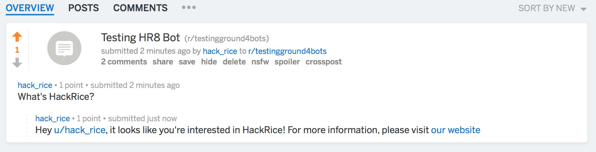

# Reddit Bot

## Introduction

This document will provide a step-by-step gudie to developing your first Reddit bot. We'll be using Python since it's a very beginner-friendly language and offers perhaps the simplest implementation, mostly since there exists a very intuitive python library for Reddit's API. Alternatively, you're welcome to use JavaScript + Node.js, in which case you can find an excellent guide [here](https://blog.syntonic.io/2017/07/07/reddit-bot-nodejs-example/).

Our bot will look at the comments in a given subreddit, and provide information about HackRice if it detects user interest. We'll do this very simply by checking if the comment text includes "hackrice". If so, our bot will reply with a friendly message to the user and a link to the HackRice website.


## Software

Before we begin, we need to make sure all the necessary software is installed. Here are the things you'll need:
* [Python 3.6.5](https://www.python.org/downloads/release/python-365/)
* Pip3


### Cygwin installation (Windows users only)

Visit [this website](https://cygwin.com/install.html) to install Cygwin.  For each screen on the installer where it provides a default option, the default is fine.  However, there is one screen that asks you to "Choose A Download Site".  Any site should work; however, some work better than others.  [This site](https://mirror.steadfast.net) works well.

From this point on, whenever the tutorial says to use the terminal, you should use Cygwin instead.

### Dependencies
Most newer versions of Python come with pip, so it should be already installed. Specifically, we want to have pip3 installed. To check if you have pip installed already, type `which pip3` into the terminal. You should see the version number printed to the terminal if you have it.

If you don't have pip, you can install it [here](https://pip.pypa.io/en/stable/installing/).

This app has only one dependency which is PRAW 4, a Python wrapper for the Reddit API. Now that we have pip, we can enter into the terminal to install it:
```pip3 install praw```

## Bot Registration

We need to register the bot with reddit to enable it to actually interact with the site. To do this, you'll need to log in to Reddit or create a new account. Each bot is linked with an account so we'd advise creating a new account unless you want the bot's posts to appear under your account. Navigating to the *preferences* page, you should see a tab titled *Apps*, with a button at the bottom that says "are you a developer? create an app...". 


Click on this button, and you'll be prompted to enter information about your bot. The title and description aren't very important, and you can check the *script* radio button since this won't be a full web app (not yet). Since this is only a script, the about url and redirect url fields aren't important, so free to type in any url you want. Once you click "create app", you should see something like this:


## Implementation

Now, we can start coding. In the text editor of your choice, start your file with 

```python
import praw
```

to get access to the Reddit API wrapper. Now, to create a new bot instance, we can simply call `praw.Reddit()` which takes the user agent, client id, client secret, and account username and password. The user agent is the name of the bot (in the above image, our user agent is "hack_rice_bot"), the client id is the character sequence below the user agent, the client secret is the character sequence key provided next to the label "secret", and the username/password are for the account under which the bot was made. Pass in the information to create a bot instance as follows:

```python
bot = praw.Reddit(user_agent = "USER_AGENT",
                  client_id = "CLIENT_ID",
                  client_secret = "CLIENT_SECRET",
                  username = "USERNAME",
                  password = "PASSWORD")
```

Now that we've created a bot, we have to give it instructions on how to act. The bot has to be directed to some data source and reply based on the data. We can point the bot to a specific subreddit via the `subreddit()` method as follows:

```python
subreddit = bot.subreddit('testingground4bots')
```

While testing your bot, we encourage you test on r/testingground4bots, which is the subreddit in which our bot will function. Next, we want our bot to function in real time, so we need to feed it a live stream of comments. PRAW makes this very easy to do with the `stream` object, and we can simply write: 

```python
comments = subreddit.stream.comments()
```

This line effectively generates a real time collection of comments in the subreddit, and handles all of the tedious work such as verifying compliance with Reddit's API rate limits. We can then iterate over the comments generator and extract information from each comment, as well as reply to it.

```python
for comment in comments: 
    text = comment.body ## Get comment's body
    author = comment.author ## Get comment's body
    if 'hackrice' in text.lower():
        ## Generate message
        message = "Hey u/{0}, it looks like you're interested in HackRice! For more information, please visit [our website](http://hack.rice.edu)".format(author)
        comment.reply(message) ## Send message
```

The comment object contains many fields, but we're only considering the body, or actual text, of the comment, and the author. We then test if the user is 'interested' in HackRice, and choose to invoke the `reply()` method, which takes a string as an input and posts a comment replying to the original. And, now we're done with our simple Reddit bot! Here's how the whole program should look when we put it together (you can also view the file in the repo)

```python
import praw

## Creating a new bot instance 
bot = praw.Reddit(user_agent = "USER_AGENT",
                  client_id = "CLIENT_ID",
                  client_secret = "CLIENT_SECRET",
                  username = "USERNAME",
                  password = "PASSWORD")

## This subreddit is useful
subreddit = bot.subreddit('testingground4bots')

## This maintains a constant stream of comments in real time
comments = subreddit.stream.comments()

## Looks at every comment
for comment in comments: 
    text = comment.body ## Get comment's body
    author = comment.author ## Get comment's body
    if 'hackrice' in text.lower():
        ## Generate message
        message = "Hey u/{0}, it looks like you're interested in HackRice! For more information, please visit [our website](http://hack.rice.edu)".format(author)
        comment.reply(message) ## Send message
 ```

You can run the script by opening up terminal, navigating to the right directory, and entering

```python3 reddit-bot.py```


Since our script is going to be parsing every comment in real time, it'll never terminate on its own. If you want to quit it, you can enter *Ctrl+C* to manually interrupt execution. You can verify that your bot is working by going to /r/testingground4bots and posting a comment with "HackRice" in it. You should shortly receive a notification in your inbox, with the bot's reply





### Next Steps

Cool, now that we've got this simple bot working, there's a lot of different things we can do with it. The nice thing about a bot is that there's no front end work to be done, so we can focus entirely on backend code. Some interesting ideas for bots include

* Integrating Natural Language Processing to summarize articles
* Automating a specific task to moderate communities
* Parsing comments for spam detection
* Using Machine Learning to forecast comment karma
* Using CV to generate textual descriptions of photos from imgur links
* Detecting questions on a programming subreddit and searching StackOverflow for answers

Or, if you're up for the challenge, instead of relying on PRAW, try directly making the Reddit API calls via the `requests` library. For exploring additional functionality offered by the Reddit API, check out the [Reddit API Documentation](https://www.reddit.com/dev/api/). Good Luck!

# FAQ
  
If you have any general questions about this track or about setting up your development environment, take a look at our [FAQ](https://github.com/jpa99/HR8-First-Timers-Track/tree/master/FAQ.md). If you're still stuck, reach out to a mentor or one of the HackRice organizers and we'll be happy to point you in the right direction.
  


