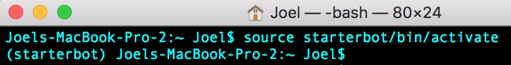
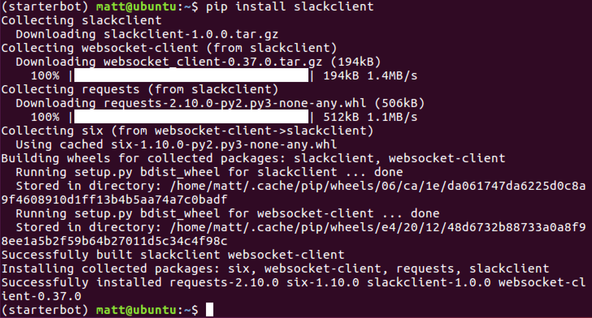
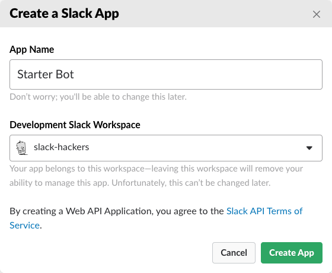
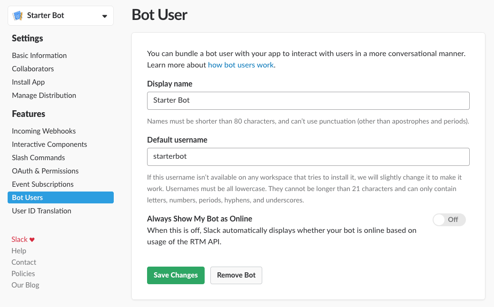
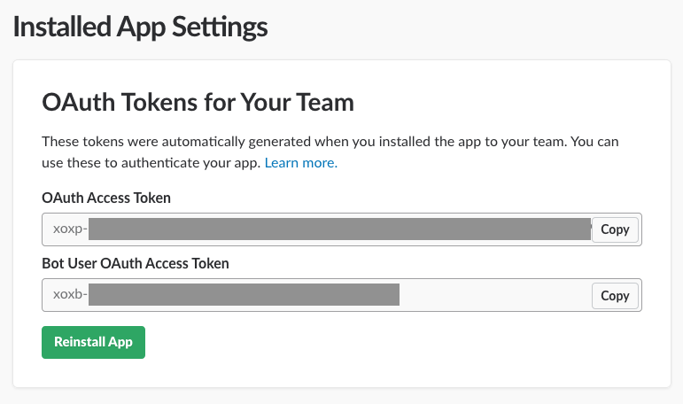
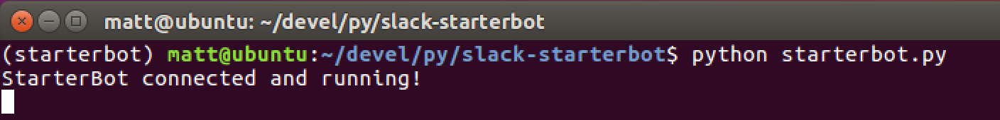
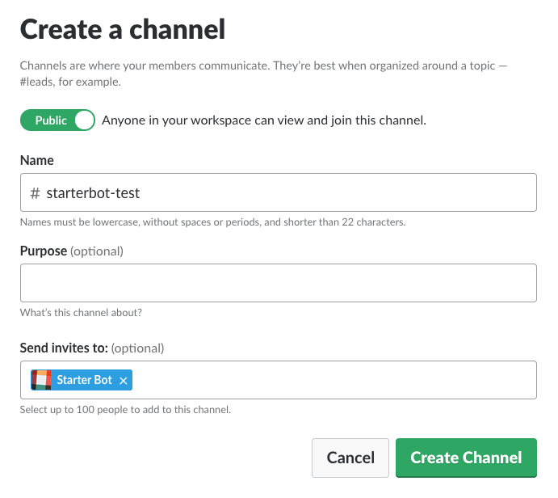
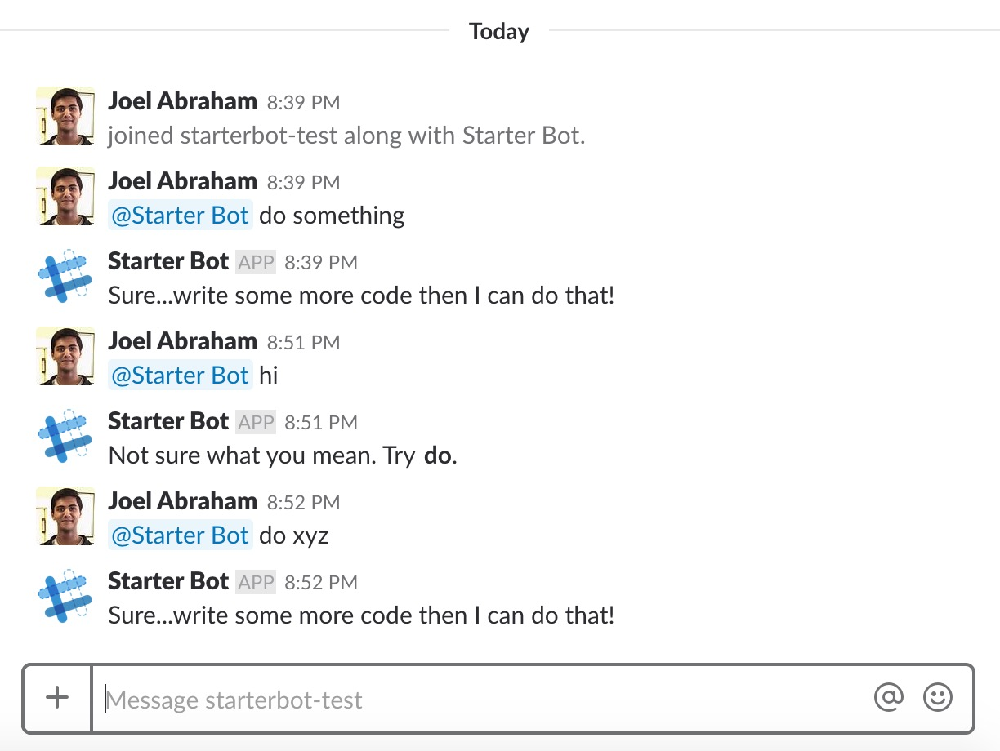

# Slack Bot

**Borrowed from a Post updated by Matt Makai on December 13, 2017. Originally posted on June 04, 2016.**


## Introduction

Bots are a useful way to interact with chat services such as Slack. If you have never built a bot before, this post provides an easy starter tutorial for combining the Slack API with Python to create your first bot.

We will walk through setting up your development environment, obtaining a Slack API bot token and coding our simple bot in Python.

## Tools needed

Our bot, which we will name "StarterBot", requires Python and the Slack API. To run our Python code we need:

* Either [Python 2 or 3](https://www.fullstackpython.com/python-2-or-3.html) (Python 2 must be at least version 2.7.9)
* [pip](https://pip.pypa.io/en/stable/) and
  [virtualenv](https://virtualenv.pypa.io/en/stable/) to handle Python
  [application dependencies](https://www.fullstackpython.com/application-dependencies.html)
* [Free Slack account](https://slack.com/) - you need to be signed into at
  least one workspace where you have access to building apps.
  
In addition, Windows users will need To install Cygwin (more on this below).

It is also useful to have the Slack API docs handy while you're building this tutorial.
All the code for this tutorial is available open source under the MIT license in the slack-starterbot public repository.

### Cygwin installation (Windows users only)

Visit [this website](https://cygwin.com/install.html) to install Cygwin.  For each screen on the installer where it provides a default option, the default is fine.  However, there is one screen that asks you to "Choose A Download Site".  Any site should work; however, some work better than others.  'https://mirror.steadfast.net' works well.

From this point on, whenever the tutorial says to use the terminal, you should use Cygwin instead.

### Pip installation
If you don't already have pip installed, we'll go ahead an install that now because it will be essential 
for the rest of the project. 

Visit [this website](https://pip.pypa.io/en/stable/installing/) to install pip. Follow the instructions, and once you 
think you're done, type `which pip` to check that pip has been installed. You should see the version number of the pip 
you installed print to your terminal.

## Establishing Our Environment
We now know what tools we need for our project so let's get our development
environment set up. Go to the terminal (or Cygwin on Windows) and
change into the directory where you want to store this project. Within
that directory, create a new virtualenv to isolate our application
dependencies from other Python projects.

    virtualenv starterbot

Activate the virtualenv (Mac/Linux):

    source starterbot/bin/activate

Activate the virtualenv (Windows):

    source starterbot/Scripts/activate

Your prompt should now look like the one in this screenshot.



The official `slackclient` API helper library built by Slack can send and
receive messages from a Slack channel. Install the slackclient library with
the `pip` command:

    pip install slackclient

When `pip` is finished you should see output like this and you'll be
back at the prompt.




We also need to [create a Slack App](https://api.slack.com/apps/new) to recieve
an API token for your bot. Use "Starter Bot" as your App name. If you are signed
into more than one workspace, pick a Development Workspace from the dropdown.



After submitting the form, keep the app configuration page open.

## Slack APIs and App Configuration

We want our Starter Bot to appear like any other user in your team - it will
participate in conversations inside channels, groups, and DMs. In a Slack
App, this is called a [bot user](https://api.slack.com/bot-users), which
we set up by choosing "Bot Users" under the "Features" section. After
clicking "Add a Bot User", you should choose a display name, choose a
default username, and save your choices by clicking "Add Bot User". You'll
end up with a page that looks like the following:



The `slackclient` library makes it simple to use Slack's
[RTM API](https://api.slack.com/rtm) and [Web API](https://api.slack.com/web).
We'll use both to implement Starter Bot, and they each require authentication.
Conveniently, the bot user we created earlier can be used to authenticate for
both APIs.

Click on the "Install App" under the "Settings" section. The button on this page
will install the App into our Development Workspace. Once the App is installed,
it displays a *bot user oauth access token* for authentication as the bot user.



A common practice for Python developers is to export secret tokens as
environment variables. Back in your terminal, export the full Slack token with the
name `SLACK_BOT_TOKEN` and make sure to surround your token with quotes:

    export SLACK_BOT_TOKEN='your bot user OAuth access token here'

Nice, now we are authorized to use the Slack RTM and Web APIs as a bot user.

Note that you should be using the Bot User OAuth Access Token, not the OAuth Access Token.

## Coding Our Starter Bot
We've got everything we need to write the Starter Bot code. Create a new file
named `starterbot.py` and include the following code in it.

```python
    import os
    import time
    import re
    from slackclient import SlackClient
```


With our dependencies imported we can use them to obtain the environment
variable values and then instantiate the Slack client.

```python
    # instantiate Slack client
    slack_client = SlackClient(os.environ.get('SLACK_BOT_TOKEN'))
    # starterbot's user ID in Slack: value is assigned after the bot starts up
    starterbot_id = None

    # constants
    RTM_READ_DELAY = 1 # 1 second delay between reading from RTM
    EXAMPLE_COMMAND = "do"
    MENTION_REGEX = "^<@(|[WU].+?)>(.*)"
```
   


The code instantiates the `SlackClient` client with our `SLACK_BOT_TOKEN`
exported as an environment variable. It also declares a variable we can use to
store the Slack user ID of our Starter Bot. A few constants are also declared,
and each of them will be explained as they are used in the code that follows.

```python
  if __name__ == "__main__":
        if slack_client.rtm_connect(with_team_state=False):
            print("Starter Bot connected and running!")
            # Read bot's user ID by calling Web API method `auth.test`
            starterbot_id = slack_client.api_call("auth.test")["user_id"]
            while True:
                command, channel = parse_bot_commands(slack_client.rtm_read())
                if command:
                    handle_command(command, channel)
                time.sleep(RTM_READ_DELAY)
        else:
            print("Connection failed. Exception traceback printed above.")


```
  
The Slack client connects to the Slack RTM API. Once it's connected, it calls a
Web API method ([`auth.test`](https://api.slack.com/methods/auth.test)) to find
Starter Bot's user ID.

Each bot user has a user ID for each workspace the Slack App is installed
within. Storing this user ID will help the program understand if someone has
mentioned the bot in a message.

Next, the program enters an infinite loop, where each time the loop runs the
client recieves any events that arrived from Slack's RTM API. Notice that
before the loop ends, the program pauses for one second so that it doesn't loop
too fast and waste your CPU time.

For each event that is read, the `parse_bot_commands()` function determines if
the event contains a command for Starter Bot. If it does, then `command` will
contain a value and the `handle_command()` function determines what
to do with the command.

We've laid the groundwork for processing Slack events and calling Slack methods
in the program. Next, add three new functions above the previous snippet to
complete handling commands:

```python
    def parse_bot_commands(slack_events):
        """
            Parses a list of events coming from the Slack RTM API to find bot commands.
            If a bot command is found, this function returns a tuple of command and channel.
            If its not found, then this function returns None, None.
        """
        for event in slack_events:
            if event["type"] == "message" and not "subtype" in event:
                user_id, message = parse_direct_mention(event["text"])
                if user_id == starterbot_id:
                    return message, event["channel"]
        return None, None

    def parse_direct_mention(message_text):
        """
            Finds a direct mention (a mention that is at the beginning) in message text
            and returns the user ID which was mentioned. If there is no direct mention, returns None
        """
        matches = re.search(MENTION_REGEX, message_text)
        # the first group contains the username, the second group contains the remaining message
        return (matches.group(1), matches.group(2).strip()) if matches else (None, None)

    def handle_command(command, channel):
        """
            Executes bot command if the command is known
        """
        # Default response is help text for the user
        default_response = "Not sure what you mean. Try *{}*.".format(EXAMPLE_COMMAND)

        # Finds and executes the given command, filling in response
        response = None
        # This is where you start to implement more commands!
        if command.startswith(EXAMPLE_COMMAND):
            response = "Sure...write some more code then I can do that!"

        # Sends the response back to the channel
        slack_client.api_call(
            "chat.postMessage",
            channel=channel,
            text=response or default_response
        )

```

The `parse_bot_commands()` function takes events from Slack and determines
if they are commands directed at Starter Bot. There are many
[event types](https://api.slack.com/events) that our bot will encounter, but to
find commands we only want to consider
[message events](https://api.slack.com/events/message). Message events also have
subtypes, but the commands we want to find won't have any subtype defined. The
function filters out uninteresting events by checking these properties. Now we
know the event represents a message with some text, but we want to find out
if Starter Bot is being mentioned in the text. The `parse_direct_mention()`
function will figure out of the message text starts with a mention, and then
we compare that to the user ID we stored earlier for Starter Bot. If they are
the same, then we know this is a bot command, and return the command text with
the channel ID.

The `parse_direct_mentions()` function uses a regular expression to determine
if a user is being mentioned *at the beginning* of the message. It returns
the user ID and the remaining message (and `None, None` if no mention was
found).

The last function, `handle_command()` is where in the future you'll add all the
interesting commands, humor, and personality for Starter Bot. For now, it has
just one example command: *do*. If the command starts with a known command, it
will have an appropriate response. If not, a default response is used. The
response is sent back to Slack by calling the
[`chat.postMessage`](https://api.slack.com/methods/chat.postMessage) Web API
method with the channel. You can extend this function to handle more commands 
and expand the functionality of your slackbot. 

Here is how the entire program should look when it's all put together
(you can also
view the file in GitHub):

```python
import os
import time
import re
from slackclient import SlackClient


# instantiate Slack client
slack_client = SlackClient(os.environ.get('SLACK_BOT_TOKEN'))
# starterbot's user ID in Slack: value is assigned after the bot starts up
starterbot_id = None

# constants
RTM_READ_DELAY = 1 # 1 second delay between reading from RTM
EXAMPLE_COMMAND = "do"
MENTION_REGEX = "^<@(|[WU].+?)>(.*)"

def parse_bot_commands(slack_events):
    """
        Parses a list of events coming from the Slack RTM API to find bot commands.
        If a bot command is found, this function returns a tuple of command and channel.
        If its not found, then this function returns None, None.
    """
    for event in slack_events:
        if event["type"] == "message" and not "subtype" in event:
            user_id, message = parse_direct_mention(event["text"])
            if user_id == starterbot_id:
                return message, event["channel"]
    return None, None

def parse_direct_mention(message_text):
    """
        Finds a direct mention (a mention that is at the beginning) in message text
        and returns the user ID which was mentioned. If there is no direct mention, returns None
    """
    matches = re.search(MENTION_REGEX, message_text)
    # the first group contains the username, the second group contains the remaining message
    return (matches.group(1), matches.group(2).strip()) if matches else (None, None)

def handle_command(command, channel):
    """
        Executes bot command if the command is known
    """
    # Default response is help text for the user
    default_response = "Not sure what you mean. Try *{}*.".format(EXAMPLE_COMMAND)

    # Finds and executes the given command, filling in response
    response = None
    # This is where you start to implement more commands!
    if command.startswith(EXAMPLE_COMMAND):
        response = "Sure...write some more code then I can do that!"

    # Sends the response back to the channel
    slack_client.api_call(
        "chat.postMessage",
        channel=channel,
        text=response or default_response
    )

if __name__ == "__main__":
    if slack_client.rtm_connect(with_team_state=False):
        print("Starter Bot connected and running!")
        # Read bot's user ID by calling Web API method `auth.test`
        starterbot_id = slack_client.api_call("auth.test")["user_id"]
        while True:
            command, channel = parse_bot_commands(slack_client.rtm_read())
            if command:
                handle_command(command, channel)
            time.sleep(RTM_READ_DELAY)
    else:
        print("Connection failed. Exception traceback printed above.")

```

Now that all of our code is in place we can run our Starter Bot on the
command line with the `python starterbot.py` command.



In Slack, create a new channel and invite Starter Bot or invite it to an
existing channel.



Now start giving Starter Bot commands in your channel.




## Wrapping Up
Alright, now you've got a simple Starter Bot with a bunch of places in the
code you can add whatever features you want to build.

There is a whole lot more that could be done using the Slack RTM API and Python.
Check out these posts to learn what you could do:

* Attach a persistent [relational database](https://www.fullstackpython.com/databases.html) or
  [NoSQL back-end](https://www.fullstackpython.com/no-sql-datastore.html) such as
  [PostgreSQL](https://www.fullstackpython.com/postgresql.html), [MySQL](https://www.fullstackpython.com/mysql.html) or [SQLite](https://www.fullstackpython.com/sqlite.html)
  to save and retrieve user data
* Add another channel to interact with the bot
  [via SMS](https://www.twilio.com/blog/2016/05/build-sms-slack-bot-python.html)
  or
  [phone calls](https://www.twilio.com/blog/2016/05/add-phone-calling-slack-python.html)
* [Integrate other web APIs](https://www.fullstackpython.com/api-integration.html) such as
  [GitHub](https://developer.github.com/v3/) or [Twilio](https://www.fullstackpython.com/twilio.html)
* Explore other [Slack Platform APIs](https://api.slack.com) and the [reasons you might use one over another](https://medium.com/slack-developer-blog/getting-started-with-slacks-apis-f930c73fc889).
* Build an [onboarding bot using the Slack Events API](https://github.com/slackapi/Slack-Python-Onboarding-Tutorial)
* Integrate [natural language processing](https://medium.com/@nidhog/how-to-make-a-chatbot-on-slack-with-python-82015517f19c) to better interact with users or create a chatbot.


# FAQ
  
If you have any general questions about this track or about setting up your development environment, take a look at our [FAQ](https://github.com/jpa99/HR8-First-Timers-Track/tree/master/FAQ.md). If you're still stuck, reach out to a mentor or one of the HackRice organizers and we'll be happy to point you in the right direction.
  

